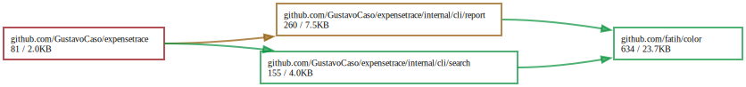

+++
title =  "Optimizing Go Binaries: Understanding Your Project's Dependencies"
date = 2025-01-18
tags = ["go", "dependencies"]
+++

At Datadog, I work on the Agent, a complex and substantial Go codebase. The Agent is designed to run on customer infrastructure, aggregating customer data and sending it to Datadog for real-time analysis.


Since the Agent operates within customer environments, performance is a key factor in how we design our software. Over the years, the matrix of features and products has continued to grow. These features and products come with costs, which typically manifest in resource consumption and binary size. We pay special attention in terms of memory and CPU. Ensuring that the Agent is as lean as possible is crucial to Datadog's success.


Over the past few months, my team has worked on optimizing the Agent codebase. To achieve this, we needed to understand what gets included in the final binary we distribute to our customers. I will explain some of the techniques we've applied to understand the dependency graph of the Agent codebase.


### Understanding Go Binaries

Before diving into the techniques, it's important to understand a few key aspects of how Go builds its binaries and how those details affect binary size and memory usage. Typically, we use Go tooling to construct a Go binary, with the `go build` command handling everything for us. We won’t dive into the details of how it works in this post, but the key point is that Go builds **statically linked binaries**. This means everything required to run the binary, including all libraries and dependencies, is contained within it. This is a convenient feature because it ensures portability—however, it can also result in larger binaries, which in turn increases memory consumption at runtime. The binary size is correlated with the memory consumption because of the amount of memory the Go runtime has to map in the OS. To understand this last statement, we need to know what parts of the binary the Go runtime loads into memory. There are tons of resources on the internet, such as [this guide](https://trungnt2910.com/binary-loading-basics/) and [this Gist](https://gist.github.com/CMCDragonkai/10ab53654b2aa6ce55c11cfc5b2432a4). For our use case, we’re going to focus on two sections:

- **Text Segment**: The actual machine code (instructions).
- **Data Segment**: Initialized global variables.

Since Go binaries are statically linked, all our code and the code of our dependencies are loaded into memory, including machine code and global variables. When we add more dependencies to our project, the binary grows larger because the code from external libraries is also included. This increases memory consumption when the program runs, as the larger binary requires more memory to be mapped into RAM. More dependencies mean more memory, which ultimately increases the Resident Set Size (RSS), which represents the portion of memory actively used by the program.

### Inspecting a Simple Go Binary

To illustrate this, let’s consider the classic example of a Hello World program in Go.

```go
package main

import "fmt"

func main() {
    fmt.Println("Hello World")
}
```

Let's see what is the binary size of our Hello World program.
```
$ go build -o helloworld .
$ du -sh helloworld
1.9M	helloworld
```

Our Hello World program weigths 1.9 MB. That’s quite a bit for a simple Hello World program. So, what’s included in this binary?

We’ll use several tools provided by the Go toolchain, as well as some open-source tools from the community, to get a list of all the dependencies and libraries our binary relies on.

To do this, we can run the [go list](https://pkg.go.dev/cmd/go#hdr-List_packages_or_modules) command. Simply running `go list .` won’t provide much information, so we can modify the output format using the `-f` flag. If we run `go list -f '{{join .Deps "\n"}}' .`, we will obtain a complete list of package dependencies for our program:

```
$ go list -f '{{join .Deps "\n"}}' .
cmp
errors
fmt
internal/abi
internal/bytealg
internal/chacha8rand
internal/coverage/rtcov
internal/cpu
internal/fmtsort
internal/goarch
internal/godebugs
internal/goexperiment
internal/goos
internal/itoa
...
```

### Digging Deeper into Dependencies

If we want to see which dependencies are included by a specific package, we can modify the target of the `go list` command. For example, to see the dependencies of the `math` package, we can run:


```
$ go list -f '{{join .Deps "\n"}}' math
math/bits
unsafe
```

At this point, we could keep exploring further to fully understand the dependency chain, but depending on the size of your project, there could be hundreds of dependencies. Simply using `go list` might not be enough to give us the full picture.

### Understanding Why A Module is included in your Project

Sometimes, it’s not enough to know which dependencies are part of your binary. We also want to understand _why_ they’re included. This is where [go mod why](https://go.dev/ref/mod#go-mod-why) comes in. This command shows us the shortest path from our main module to the listed package.

```
$ go mod why io
# io
github.com/GustavoCaso/sandbox/go/helloworld
fmt
io
```

Here, we see that the `io` package is included by the `fmt` package, which is included by our HelloWorld project. While this example is obvious, in a large project with many dependencies, this tool becomes much more useful.

### Analyzing the Size of Dependencies

Now that we know which dependencies are included, the next step is understanding how much space each of these dependencies takes up. Not all dependencies contribute to binary size equally, so it’s important to measure them.


For this, we can use a popular open-source tool called [go-size-analyzer](https://github.com/Zxilly/go-size-analyzer/tree/master) (GSA). GSA provides detailed information about the size of each package in the binary. Here's an example of the output for our `helloworld` binary:


```
$ gsa helloworld --hide-sections

┌──────────────────────────────────────────────────────────────────────────────────────────┐
│ helloworld                                                                               │
├─────────┬───────────────────────────────────────────────────────────┬────────┬───────────┤
│ PERCENT │ NAME                                                      │ SIZE   │ TYPE      │
├─────────┼───────────────────────────────────────────────────────────┼────────┼───────────┤
│ 33.28%  │ runtime                                                   │ 675 kB │ std       │
│ 2.77%   │ time                                                      │ 56 kB  │ std       │
│ 2.28%   │ reflect                                                   │ 46 kB  │ std       │
│ 2.05%   │ fmt                                                       │ 42 kB  │ std       │
│ 1.91%   │ strconv                                                   │ 39 kB  │ std       │
│ 1.08%   │                                                           │ 22 kB  │ generated │
│ 1.00%   │ syscall                                                   │ 20 kB  │ std       │
│ 0.95%   │ sync                                                      │ 19 kB  │ std       │
│ 0.56%   │ internal/poll                                             │ 12 kB  │ std       │
│ 0.40%   │ internal/fmtsort                                          │ 8.2 kB │ std       │
│ 0.39%   │ os                                                        │ 7.9 kB │ std       │
│ 0.25%   │ unicode                                                   │ 5.1 kB │ std       │
│ 0.25%   │ internal/abi                                              │ 5.0 kB │ std       │
│ 0.19%   │ internal/reflectlite                                      │ 3.9 kB │ std       │
│ 0.15%   │ internal/cpu                                              │ 3.0 kB │ std       │
│ 0.14%   │ sort                                                      │ 2.8 kB │ std       │
│ 0.10%   │ io/fs                                                     │ 2.1 kB │ std       │
│ 0.09%   │ errors                                                    │ 1.9 kB │ std       │
│ 0.09%   │ internal/chacha8rand                                      │ 1.9 kB │ std       │
│ 0.06%   │ internal/bytealg                                          │ 1.2 kB │ std       │
│ 0.04%   │ internal/itoa                                             │ 726 B  │ std       │
│ 0.02%   │ internal/testlog                                          │ 406 B  │ std       │
│ 0.01%   │ internal/syscall/unix                                     │ 272 B  │ std       │
│ 0.01%   │ main                                                      │ 226 B  │ main      │
│ 0.00%   │ github.com/GustavoCaso/helloworld                         │ 0 B    │ vendor    │
├─────────┼───────────────────────────────────────────────────────────┼────────┼───────────┤
│ 48.08%  │ Known                                                     │ 976 kB │           │
│ 100%    │ Total                                                     │ 2.0 MB │           │
└─────────┴───────────────────────────────────────────────────────────┴────────┴───────────┘


```

From this output, we can see that the largest contributor is the `runtime` package, which is essential for any Go binary and cannot be removed. However, understanding which dependencies take up the most space helps us prioritize optimization efforts. 

### Visualizing the Dependency Graph

Finally, to better understand how dependencies are spread throughout your codebase, we can use a tool like [goda](https://github.com/loov/goda?tab=readme-ov-file) to generate a visual dependency graph. This is especially useful when trying to pinpoint where a particular dependency is introduced within the project.

For example, I ran the following command on my toy project [expensetrace](https://github.com/GustavoCaso/expensetrace) to see where the `github.com/fatih/color` package is used:

```
$ goda graph -std "reach(github.com/GustavoCaso/expensetrace/...:all, github.com/fatih/color)" | dot -Tsvg -o color.svg
```



This generates a visualization of which packages are reaching the `github.com/fatih/color` dependency. By inspecting the graph, I can quickly pinpoint where the dependency is introduced and decide whether it’s worth removing or replacing. 

One crucial aspect that makes `goda` more useful than `go mod why` is that `goda` shows all the paths that lead to dependency and `go mod why` only shows one.


### Conclusion

By leveraging these tools and techniques, you can get a solid understanding of your Go project's dependencies and start making informed decisions to reduce binary size and optimize memory consumption. Once you've identified large or unnecessary dependencies, the next step might be to explore alternative libraries or refactor parts of your code to use fewer resources.


- Go typically builds statically linked binaries that contain all libraries and dependencies, which is why its binaries tend to be large.
- RSS consumption is correlated with binary size.
- To get a list of all the dependencies included in your project, run `go list -f '{{join .Deps ","}}'`.
- To understand why a package is included, use `go mod why <package>`.
- To get a detailed list of packages and their sizes, use `go-size-analyzer`.
- To get a visual representation of the dependency graph, use `goda`.


I hope these techniques help you better understand your Go project's dependencies and optimize its performance!
